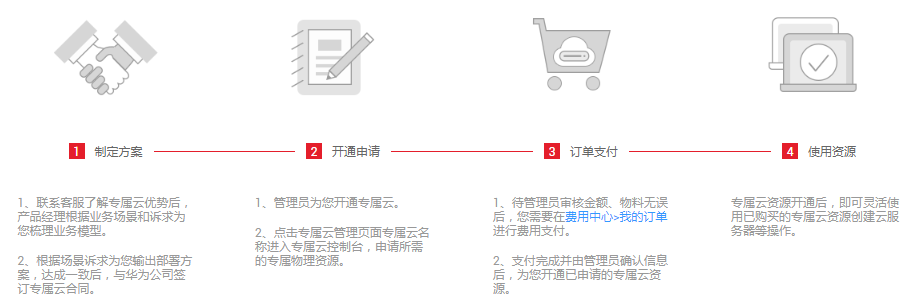

# 开通专属云

## 操作场景

专属计算集群服务不同于其他服务，用户需要先申请开通专属云访问权限后，才能申请专属计算集群的资源。

## 操作步骤

用户登录管理控制台，选择“服务列表 \> 专属云 \> 专属计算集群”，可以查看专属云的开通和资源使用流程。

**图 1**  专属云的开通和资源使用流程  

1.  拨打客服电话4000-955-988或950808 按1转1，了解专属云的优势。
2.  与客户经理进行业务洽谈，客户经理根据业务场景和诉求为您梳理业务模型，输出专属云部署方案。
3.  用户[提交工单](https://console.huaweicloud.com/ticket/?region=cn-north-1#/ticketindex/business?productTypeId=fafabf493b854a7e9c1a07b42b8bcc4b&subTypeId=113ba9e5f9e045e0ac7bcc150078c4bb&type=%E4%B8%93%E5%B1%9E%E4%BA%91)，由客服开通用户申请的专属云。
    1.  选择问题类型：产品咨询 \> 新建工单。
    2.  选择需要开通专属云的区域。
    3.  在问题描述中说明账户名称，并定义待开通的专属云名称（名称只能包含大、小写英文字母、数字、-和\_字符，最长为16位）。
    4.  按界面提示填写其他信息。
    5.  单击“提交”，提交工单。

4.  待专属云权限开通后，用户可以选择所需资源，并且灵活管理资源提升资源利用率。

