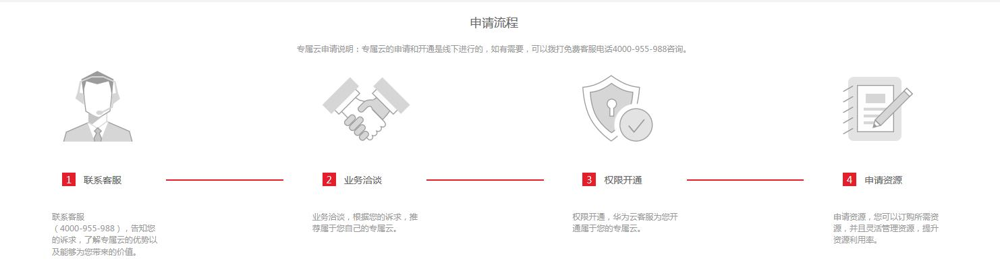

# 开通专属云

## 操作场景

专属计算集群服务不同于其他服务，用户需要先申请开通专属云访问权限后，才能申请专属计算集群的资源。

## 操作步骤

用户登录管理控制台，单击“专属计算集群”，可以查看专属云的开通和资源申请流程，如[图1](#fig33153607202130)所示。

**图 1**  专属云的开通和资源申请流程  

1.  拨打客服电话4000-955-988，了解专属云的优势。
2.  与客户经理进行业务洽谈，客户经理根据用户的诉求为用户推荐属于用户的专属云。
3.  用户提交工单，由客服开通用户申请的专属云。
    1.  注册并登录管理控制台。
    2.  单击用户名，在下拉列表中单击“提交工单”。
    3.  填写工单信息。
        -   选择专属云服务。
        -   选择问题类型：专属云开通。
        -   选择需要开通专属云的云服务区。
        -   填写问题描述。
            -   账户名称：填写您注册的华为云账户。
            -   专属云名称： 定义开通专属云的名称。（名称只能包含大小写字母、数字、-和\_字符，最长为16位，不区分大小写）

    4.  单击“提交”，提交工单。

4.  待专属云权限开通后，用户可以选择所需资源，并且灵活管理资源提升资源利用率。

