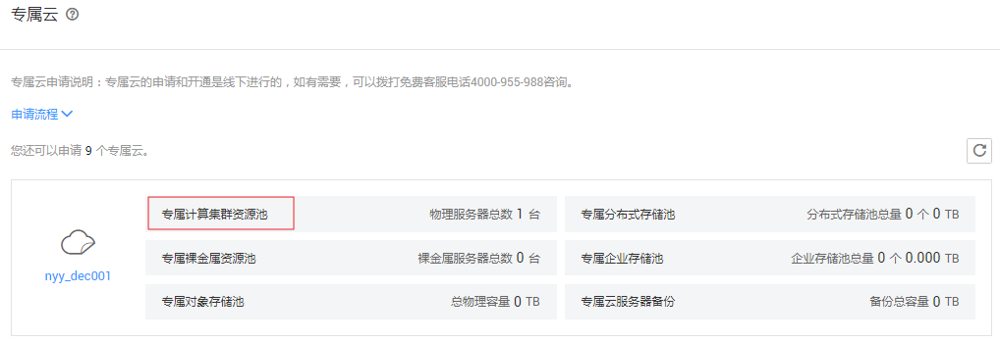
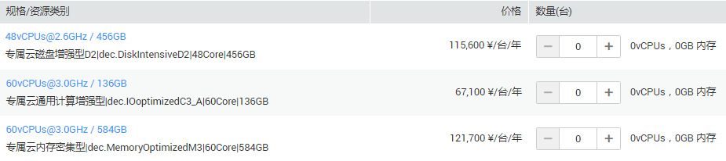

# 扩容专属计算集群资源

## 操作场景

当申请的专属计算集群资源无法满足业务需要时，用户可以对专属计算资源进行扩容。

## 操作步骤

1.  登录管理控制台。
2.  单击左侧上方区域下拉列表，切换到待扩容的专属计算集群所在服务区。
3.  选择“服务列表 \> 专属云 \> 专属计算集群”。
4.  在“专属云”界面，单击“专属计算集群资源池”，如[图1](#zh-cn_topic_0017134638_fig2236632155123)所示。

    进入专属计算集群页面。

    **图 1**  专属云信息  
    

5.  单击右上角的“申请扩容”。

    进入申请资源页面。

6.  设置所需机型的数量，并选择购买时长，如[图2](#fig64092250105250)所示。

    **图 2**  申请资源  
    

7.  单击“立即申请”。
8.  确认配置无误后，单击“提交”。
9.  任务下发成功后，系统将生成支付订单。

    待订单支付成功后，管理员会尽快安排资源扩容。扩容完成后，订单显示为完成状态。

