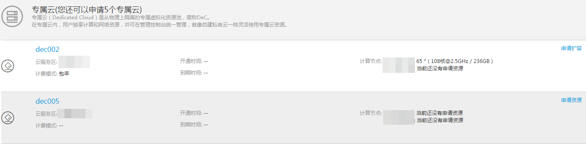
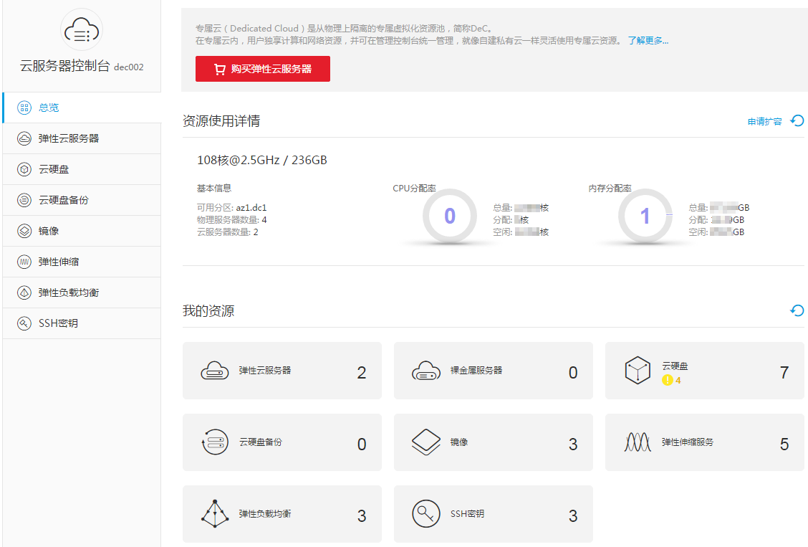

# 查询专属云信息

## 操作场景

用户可以查看在不同云服务区已经申请成功的专属云。进入指定的专属云，还可以查看该专属云内专属计算资源详情及云服务器等专属云内基础服务的实例信息。

## 查询所有云服务区的专属云

1.  登录管理控制台。
2.  单击右侧上方地域下拉列表，查询在所有云服务区申请的专属云，如[图1](#fig15663049171950)所示。

    **图 1**  所有云服务区的专属云信息  
    

## 查询指定云服务区的专属云

1.  登录管理控制台。
2.  单击右侧上方地域下拉列表，选择待查询专属云的云服务区。
3.  单击“专属云”，进入专属云信息界面，如[图2](#fig34412902163812)所示。

    **图 2**  指定云服务区的专属云详细信息  
    

## 查询专属计算集群的信息

1.  登录管理控制台。
2.  单击右侧上方地域下拉列表，如[图3](#fig22091287164336)所示。

    **图 3**  选择指定专属云  
    

3.  单击待查询的专属云名称，查看专属云内专属计算资源监控信息及专属云内云服务器等资源信息，如[图4](#fig33397139165035)所示。

    **图 4**  专属云内资源信息  
    

    其中，“资源使用详情”区域包含以下信息：

    -   物理资源规格：CPU核数@CPU主频 / 内存容量。例如：108核@2.5GHz / 236GB
    -   基本信息：
        -   可用分区
        -   物理服务器数量
        -   云服务器数量

    -   CPU分配率
        -   总量：所有物理服务器的CPU核数总和
        -   分配：已分配的CPU核数
        -   空闲：空闲的CPU核数

    -   内存分配率
        -   总量：所有物理服务器上弹性云服务器的物理内存容量总和。
        -   分配：已分配的内存容量
        -   空闲：空闲的内存容量。

4.  在“我的资源”区域，单击相关资源名称，可以查询该专属云下的各资源详情。

