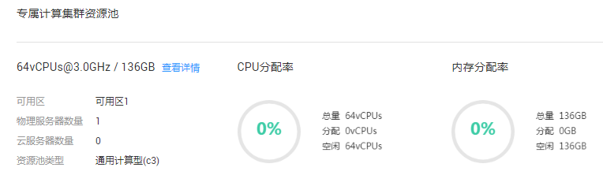

# 查询专属云信息

## 操作场景

用户可以查看在不同云服务区已经申请成功的专属云。进入指定的专属云，还可以查看该专属云内专属计算资源详情及云服务器等专属云内基础服务的实例信息。

## 查询所有云服务区的专属云

1.  登录管理控制台。
2.  单击左侧上方区域下拉列表，查询在所有云服务区申请的专属云，如[图1](#fig1487542954813)所示。

    **图 1**  所有云服务区的专属云信息  
    

## 查询指定云服务区的专属云

1.  登录管理控制台。
2.  单击左侧上方区域下拉列表，选择待查询专属云的云服务区。
3.  选择“服务列表 \> 专属云 \> 专属计算集群”，进入专属计算集群页面。

## 查询专属计算集群的信息

1.  登录管理控制台。
2.  按照[查询指定云服务区的专属云](#section1977903916141)中的指导进入专属计算集群页面。
3.  查看专属云内专属计算资源监控信息及专属云内云服务器等资源信息。

    **图 2**  专属计算集群资源  
    

    包含以下信息：

    -   物理资源规格：CPU核数@CPU主频 / 内存容量。例如：64vCPUs@3.0GHz / 136GB
    -   基本信息：
        -   可用区
        -   物理服务器数量
        -   云服务器数量
        -   资源池类型

    -   CPU分配率
        -   总量：所有物理服务器的CPU核数总和
        -   分配：已分配的CPU核数
        -   空闲：空闲的CPU核数

    -   内存分配率
        -   总量：所有物理服务器上弹性云服务器的物理内存容量总和
        -   分配：已分配的内存容量
        -   空闲：空闲的内存容量

4.  单击“查看详情”，在物理服务器列表查看已申请的所有物理服务器，也可以单击物理服务器名称，查询该物理服务器下创建的所有云服务器。

