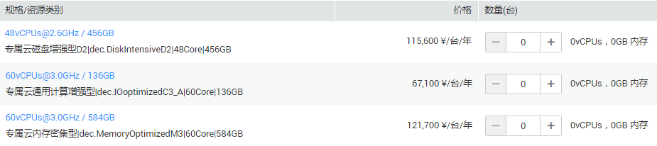

# 申请专属计算集群资源

## 操作场景

用户开通专属云服务后，可申请专属计算集群资源。

## 操作步骤

1.  登录管理控制台。
2.  单击“专属计算集群”。
3.  在专属云页面，选择需要申请资源的专属云所在行，单击“申请资源”。

    **图 1**  单击申请资源  
    

4.  在“申请资源”页面，根据提示配置参数，如[图2](#fig14525636204738)所示。

    **图 2**  申请资源  
    

5.  单击“立即申请”。
6.  确认配置无误后，单击“提交申请”。
7.  任务下发成功后，关闭创建界面。

